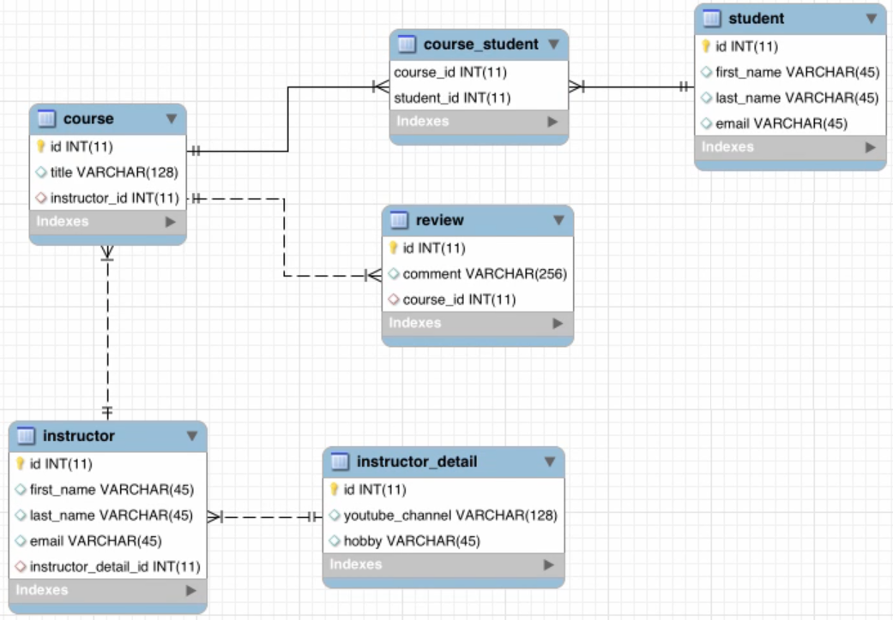
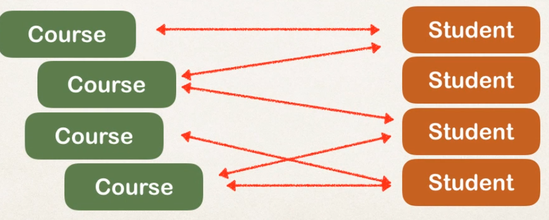

#  Hibernate - Many to Many - CRUD - MySQL

:fallen_leaf:  :leaves: This project was done using these classes in the image. :leaves: :fallen_leaf:

Here you can find many to many relationships over Hibernate + CRUD.

## All classes 
- course_student is a join table.

  

## Simple example of Many to many

  

  
  
  
  
