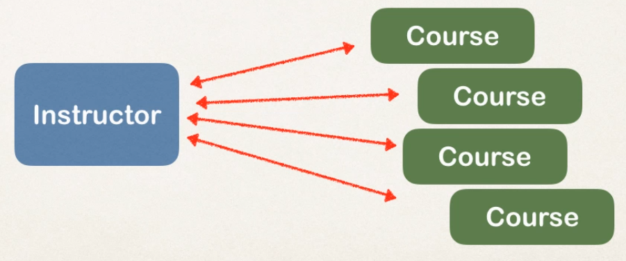
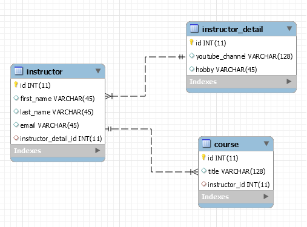

# One to Many - Bi Directional relationship

:fallen_leaf:  :leaves: TThis project was done using these classes in the image :leaves: :fallen_leaf:

In this project you can find two examples of classes. One of them is Bi-Directional and the other one is about Bi-Directional deleting a person.

One to Many Bi-Directional Classes

  
