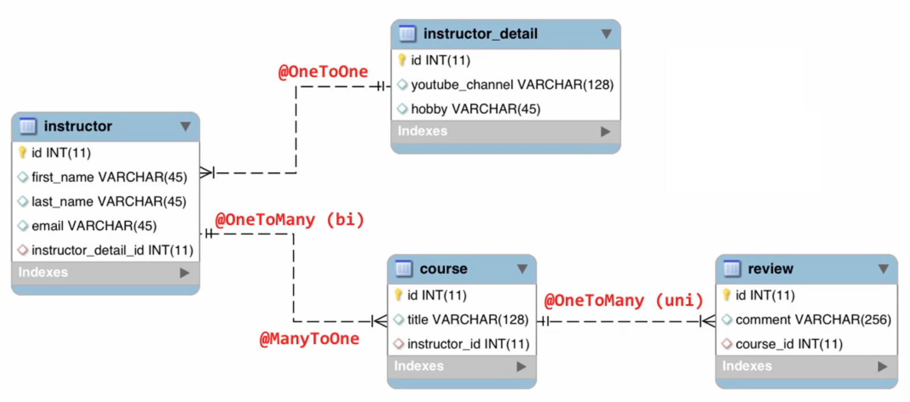

# One to Many - Uni Directional relationship

:fallen_leaf:  :leaves: This project was done using these classes in the image :leaves: :fallen_leaf:

You can find example of classes which are One to Many, One to One and Many to One relationships.

### ----------------------------------- THE END --------------------------------------
