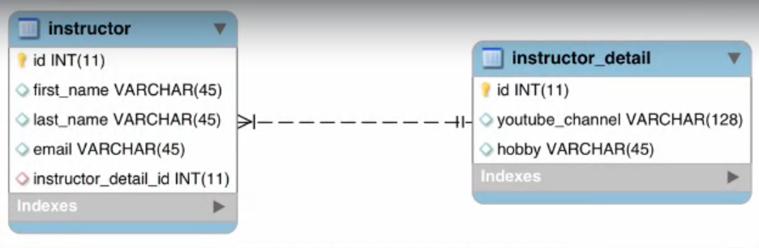
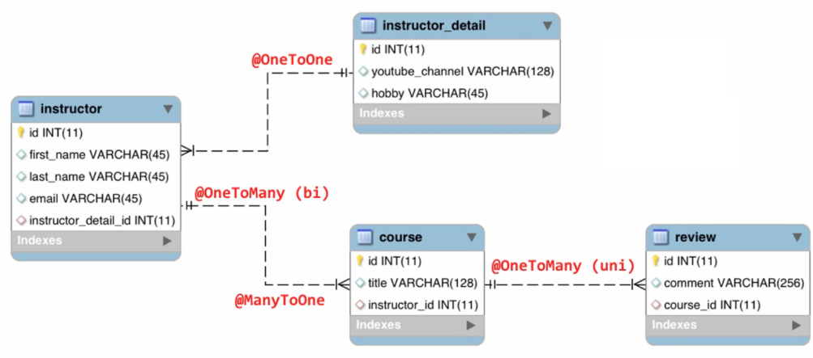
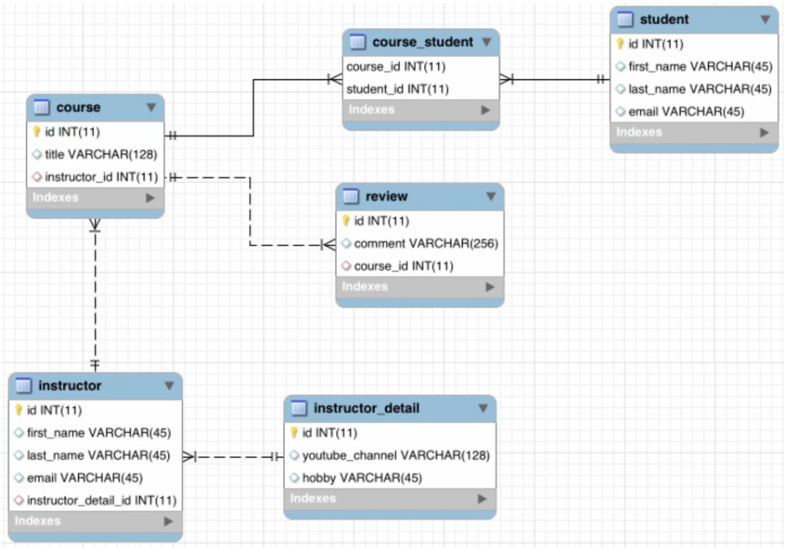

 # :fallen_leaf: :leaves: Hibernate-MySQL / PostgreSQL :leaves: :fallen_leaf:
Spring-Hibernate / PostgreSQL-MySQL database connection

In this repository, One-to-One, One-to-Many, Many-to-One and Many-to-Many relationships are done using with XML and Annotations. For each project, there will be an expositional photos..
 
Includes below: 
 
     
     
## One To One Classes

  
  
## One To Many Classes

  
  
## Many To Many Classes

  

===============================

### BalamiRR/Hibernate-PostgreSQL/HibernateMySQL

Simple MySQL connection using Hibernate in this repository.
Creating, Reading, Querying, Updating, Deleting objects and viewing hibernate SQL parameter values. (CRUD))

Fuat KARA

